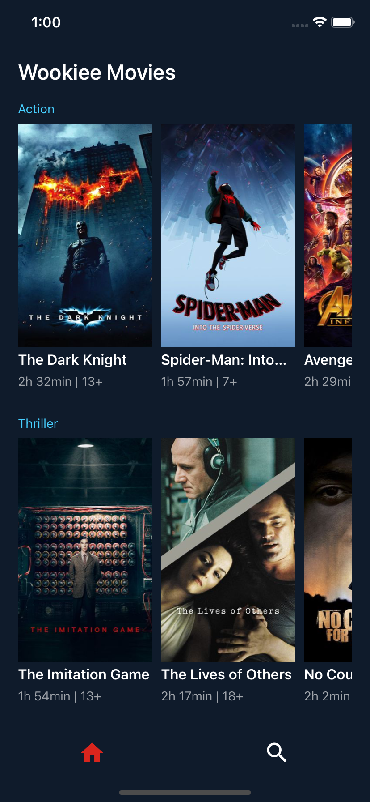
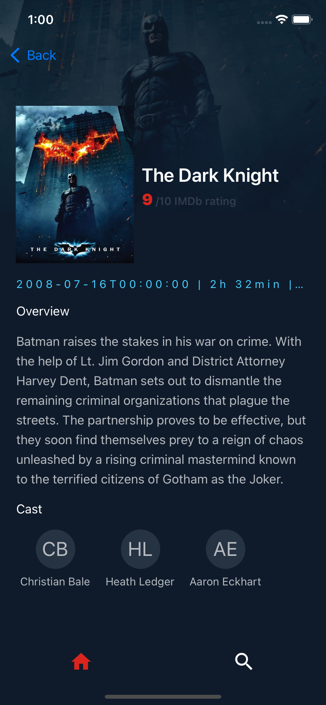

# Wookie Movie App




React Native Mobile App
* For Android: 
* For IOS: 

## Getting Started
This is a react native mobile application. This app code is preloaded with some basic libraries and basic app architecture.


## How to Use 

**Step 1:**

Download or clone this repo by using the link below:

```
git clone http://mydna-life-knjoln@git.codesubmit.io/mydna-life/mydna-wookie-moves-mlxulf
```

**Step 2:**

Go to project root and execute the following command in console to get the required dependencies: 

```
yarn install 
```

**Step 3:**

Execute the following command to run project in IOS:

```
yarn react-native run-ios
```

## App Features:


* Home Sceem
* Detail View
* Search Screen

### Libraries & Tools Used

* [React Native Elements](https://reactnativeelements.com)
* [Redux Toolkit](https://redux-toolkit.js.org)
* [React Navigation](https://reactnavigation.org)
* [React Native Vector Icons ](https://github.com/oblador/react-native-vector-icons)

### Folder Structure
Here is the core folder structure which used for this app.

```
react-native-app/
|- android
|- designs
|- ios
|- src
```

Here is the folder structure we have been using in this project

```
src/
|- components/
|- constants/
|- navigation/
|- redux/
|- screens/
|- App.js
```

Now, lets dive into the lib folder which has the main code for the application.

```
1 components 
  - Contains the common UI components of the application like Loaders Buttons InputFields
2 constants 
  - All the application level constants are defined in this file. contains the constants for `theme`, `urls`, `mock data` and `strings`
3 navigation
  — Contains the app navigation files like stack navigation and bottomtab navigation
5 redux
  — Contains the redux store of the application and redux-slice that comes with reducers and action dispatchers .
4 screens 
  — Contains the screen UIs and components for the specific screen. For example, Home, Profile etc.
5 App.js
  - This is the starting point of the application. All the application level configurations are defined in this file i.e, Providers, Navigation container
```


### SCREENS

This directory contains all the ui of the application. Each screen is located in a separate folder making it easy to combine group of files related to that particular screen. All the screen specific components will be placed in as shown in the example below:

```
screens/
|- home
   |- index.js
   |- components
      |- CardList.js
      |- MovieCard.js
```
